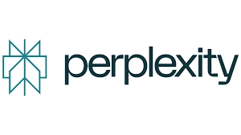

# Perplexity's $42.5M Revenue Share: Can an AI Browser Actually Pay Publishers?

---

So here's the thing: a startup called Perplexity just announced they're splitting $42.5 million with publishers. Not as a one-time PR stunt, but as an actual revenue-sharing model tied to their new AI browser, Comet. If you're running a subscription business or just trying to figure out where traffic and money are headed in the AI era, this matters more than you might think.

The model is simple on paper—publishers get 80% of subscription revenue when their content gets cited, visited, or used by Comet's AI assistant. Perplexity keeps 20%. The question is whether this is a genuine alternative to Google's search monopoly, or just a Band-Aid on a much bigger problem: AI platforms consuming content without paying for it.

---

## What Perplexity Is Doing (and Why It's Different)

Perplexity AI isn't new—it's been around since 2022. But it's not a search engine in the traditional sense. Think of it as an "answer engine." You ask a question, and instead of getting ten blue links like Google would give you, you get a direct answer with citations. It's powered by large language models and real-time web data, and it's been growing fast—hundreds of millions of queries a month, backed by Jeff Bezos, Nvidia, and SoftBank.

In July 2025, they launched **Comet**, an AI-powered browser built on Chromium. It's currently invite-only, though you can skip the waitlist if you subscribe to Perplexity Pro. Comet isn't just a browser with a chatbot bolted on. It's designed to let the AI *do things*—highlight text, answer questions in context, book flights, compare products across tabs. The browser itself becomes the assistant.

Now, with **Comet Plus**, they're adding a $5/month subscription tier. The hook? That money doesn't just go to Perplexity. It goes into a revenue pool that gets split with publishers based on how their content is used.

## How the Revenue Split Actually Works

Here's where it gets interesting. Publishers don't just get paid when someone clicks through to their site. They get paid in three ways:

- **Direct traffic**: When a Comet user visits a publisher's site from the browser
- **Citations**: When the AI assistant quotes or references the publisher's content in an answer
- **Agent-driven use**: When Comet's assistant uses the publisher's content to complete a task (like summarizing an article or pulling data for a comparison)

Publishers get 80%. Perplexity keeps 20%. And according to Jessica Chan, Perplexity's head of publisher partnerships, checks are already going out. She told Digiday that some partners could see "millions" from this model. Her pitch? "Perplexity only succeeds if journalism succeeds."

Early participants include Blavity, Der Spiegel, Fortune, Gannett, The Independent, and Time. Not a bad lineup for a beta program.

## The Catch: Legal Battles and Security Holes

Of course, this isn't happening in a vacuum. Perplexity is currently facing lawsuits from News Corp, Nikkei, Asahi Shimbun, and the BBC over alleged unauthorized use of their journalism in AI training and outputs. The revenue-sharing model might be an olive branch, but it's also a response to mounting pressure.

And then there's the security issue. Comet recently had a vulnerability that allowed hidden prompts to manipulate its AI assistant. That's been patched, but it's a reminder that AI browsers are still experimental tech. If you're a publisher considering this model, you're not just weighing revenue—you're weighing trust, control, and risk.

👉 [See how Perplexity's AI-powered search compares to traditional engines in real-world scenarios](https://pplx.ai/ixkwood69619635)

## Why This Matters for Subscription Businesses

Let's be honest: most subscription executives aren't losing sleep over AI browsers yet. But they should be paying attention.

First, **this is a new distribution channel**. If Comet takes off, it could become a meaningful source of traffic—and unlike social platforms, it's designed to send people *to* your site, not keep them in a feed. That's a big deal.

Second, **it's a new revenue stream**. Even if someone doesn't click through, you still get paid when your content is cited or used by the AI. That's fundamentally different from SEO, where you only win if someone lands on your page. It's closer to licensing, but automated and tied to usage.

Third, **it's a test case for how AI platforms will (or won't) compensate creators**. If Perplexity's model works, expect others to follow. If it flops, expect more lawsuits and regulatory pressure. Either way, the rules of the game are being written right now.

## The Bigger Picture: Google's Dominance Is Being Challenged

Here's what's really going on. Perplexity isn't just trying to be a better search engine. It's trying to replace the search engine entirely. Google's model is built on ads and links. Perplexity's model is built on answers and subscriptions. Comet takes that a step further by making the browser itself the AI agent.

If that sounds ambitious, it is. But it's also a direct shot at Google's control over how people discover and consume information online. And for publishers, that's both an opportunity and a threat.

The opportunity: a more transparent, subscription-based model that pays you for content usage, not just clicks. The threat: AI-generated answers that strip away your brand, your context, and your relationship with the reader. Even if you get paid, there's no guarantee that AI-mediated traffic converts into subscribers.

## What to Watch For

If you're running a subscription business, here's what matters:

- **Adoption**: Is Comet actually gaining users, or is it just hype? Invite-only launches are great for buzz, but they don't prove product-market fit.
- **Payouts**: Are publishers really seeing "millions," or is that just marketing? Transparency will be key.
- **Legal outcomes**: If Perplexity loses its lawsuits, the whole model could collapse. If it wins, expect more platforms to follow.
- **Conversion rates**: Does AI-driven traffic convert into subscribers, or does it just cannibalize direct visits? That's the real test.

For now, Perplexity is making a bet that publishers will choose partnership over litigation, and that users will choose AI-powered browsing over Google's link-based search. Whether that bet pays off is anyone's guess. But the fact that it's being made at all tells you something important: **the way people find, consume, and pay for content is changing fast, and AI is driving that change.**

👉 [Explore how AI-powered answer engines are reshaping content discovery and monetization](https://pplx.ai/ixkwood69619635)

---

## Conclusion

Perplexity's Comet Plus isn't just a revenue-sharing experiment—it's a signal that AI search is becoming a real alternative to Google's dominance. For subscription businesses, the $42.5 million pool and 80/20 split offer a glimpse of what monetization might look like in an AI-first world. Whether it's sustainable depends on adoption, legal outcomes, and whether AI-driven traffic actually converts. But one thing is clear: if you're in the content or subscription game, understanding why Perplexity is suitable for publisher partnerships and AI-driven discovery is no longer optional—it's strategic. The rules are being rewritten, and the platforms that figure out how to pay creators fairly might just win the next era of the web.
